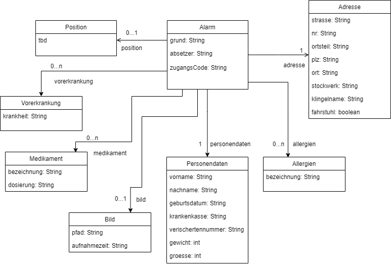

# Docs

## Input

- Notruf Start:

  + grund
  + absetzer
  + positionsdaten ??
  + vorekrankungen
  + medikamente (dosierung, bezeichnung)
  + allergien
  + bild (pfad, aufnahmezeit)
  + personendaten (vorname, nachname, geburtsdatum, groesse, gewicht, krankenkasse, versichertennummer)
  + adresse (strasse, nr, ortsteil, plz, ort, stockwerk, klingelname, fahrstuhl[ja/nein])

- Code Anfrage: Signal, dass wir einen Code an das übergeordnete System zurückgeben sollen

## Output

- Zugangscode nach einer Anfrage
- Mitteilung über erfolgreiche Alarmierung

## Zuständigkeiten

- Alarmierung der Rettungskräfte
- Bereitstellung Personendaten inkl. Gesundheitsakte
- Wohnungszugang verwalten

## Komponentendiagramm

- Alarm-Verwaltung: nimmt die Alarmierung entgegen, benachrichtigt unsere Komponenten, dass der Notruf gestartet werden soll und meldet den Erfolg bzw. Misserfolg an das übergeordnete System zurück.
(Die Komoponente kann ggf. auch das übergeordnete System über mehrfache falsch Eingabe des Türcodes informieren).
- Kommunikation: startet den Prozess der Kommunikation und bestätigt der Alarm-Verwaltung, ob der Notruf erfolgreich getätigt wurde. 
    + Fax Controller: übernimmt die Erstellung der Fax-Vorlage und sendet die Nachricht per Fax, anschließend bestätigt sie dem Controller den Erfolg.
    + SMS Controller: übernimmt die Erstellung der SMS-Nachricht und sendet die Nachricht per SMS, anschließend bestätigt sie dem Controller den Erfolg.
    + Controller: stößt den entsprechenden Controller gemäß dem Ablaufdiagramm an. Kriegt er als Rückmeldung einen Misserfolg, so wird der andere Controller angestoßen. 
- Zugangsauthentifizierer:
    + Codeverwalter: erzeugt den Authentifizierungscode, nimmt die Eingabe über das entsprechende Gerät entgegen (hier Klingel), prüft ob der Code richtig ist und macht dementsprechend die Tür auf. Dazu kommt auch, dass er verwaltet, wie lange ein Code gültig ist und wie oft der Code eingegeben werden darf, bis der Code ungültig wird.  
- Webseite: enhält das HTML-Template-Engine mit der HTML-Vorlage. Hier wird am Ende das HTML-Dokument erstellt und mithilfe des Servers zur Verfügung gestellt.
- Webserver: Darstellung und Zugang zur Webseite.

## Abläufe

siehe [Ordner Ablaeufe](./Ablaeufe/Ablauf.md)

## Zugang zum Server

### Probleme mit VPN

1. Es muss vorausgesetzt werden, dass die Leitstelle entweder einen vorkonfigurierten Client hat oder fachlich in der Lage ist, ein VPN-Profil mit unseren Konfigurationsdaten anzulegen
2. Ferner ist eine VPN-Verbindung auch problematisch, wenn die Leitstelle diese anschlißend nicht bricht. Das heißt ja dann, dass alle Daten aus und zur Leitstelle über unseren VPN-Server gehen, was ein Datenschutzproblem darstellt
3. Man könnnte theoretisch über einen Link ein VPN-Profil zur Verfügung stellen, aber das könnte an Ausführungsberechtigung am Rechner in der Leitstelle scheitern, da solche Aktionen, bei denen Netzwerkkonfigurationen manipuliert werden, nicht zugelassen werden
4. Sollte das Berechtigungsproblem in Punkt 3 doch nicht vorkommen, dann müsste ein Server trotzdem im Internet stehen, damit der Link überhaupt funktioniert.

### Alternative zu VPN

- Wir können trotzdem den Server ins Internet stellen, allerdings mit einem beschränktem Zugriff über Port 443 (https)
- Der Server wird dann hochgefahren, wenn ein Alarm auftritt, so können Angreifer keine Aktionen durchführen, die etwas länger dauern (Port Scans etc.)
- Die Zugriffsbeschränkung bezieht sich dann auf die lokale IP-Adresse mit der entsprechenden Portnummer des Servers
- Eine Firewall regelt die Verbindung nach außen (Beispiel: Verbindung über TCP Port 443 weiterleiten an ServerIP:Port)
- Wenn man die Kosten tragen kann, dann könnte man eine DMZ einrichten mit zwei Firewalls, wobei der Server mit den Daten in der DMZ steht

## Klingel

### Sicherheitskonzept

1. Der Türcode ist eine zufällige 5 Zeichen lange Permutation aus Lang und Kurz
2. Es existiert immer nur ein Türcode zur Zeit
3. Ein Türcode wird nur erzeugt wenn einer angefordert wurde, in diesem Moment wird dazu auch ein 10 stelliger Backup Code generiert
4. Dieser ist eine bestimmte Zeit verfügbar, wird in dieser ein weiterer Code angefordert wird die Zeit wieder zurückgesetzt
5. Nach 10 Fehlversuchen: 5 stelliger Code wird ungültig
6. Von nun an ist das Öffnen mit dem Backup Code möglich
7. Nach richtiger Eingabe eines code darf 4s lang keine Eingabe erfolgen

### Klassendiagramm

### LED Bedeutungen

- LED leuchtet 3s Grün, sobald der Code richtig eingegeben wurde und die Tür sich offnet
- LED leuchtet 3s Rot, sobald der Nutzer einen Reset durchführt
- LED leuchtet für (0.1s) Orange, sobald Kurz gedrückt wurde
- LED leuchtet für (0.5s) Orange, sobald Lang gedrückt wurde

## Nachrichtenschema

### JSON

siehe [JSON_Schema.txt](./JSON_Schema.txt)
