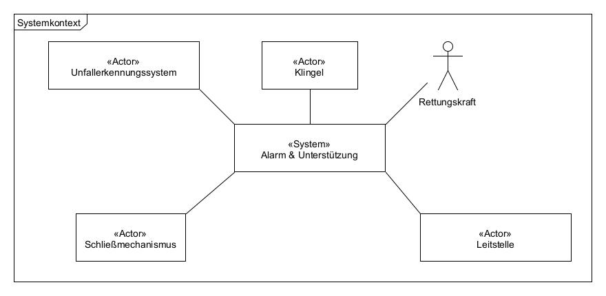
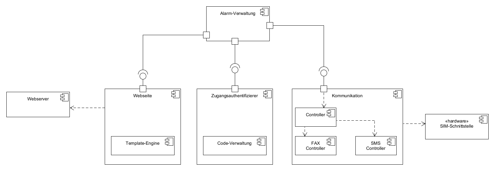
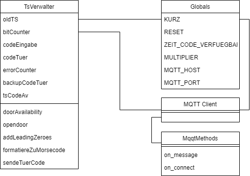
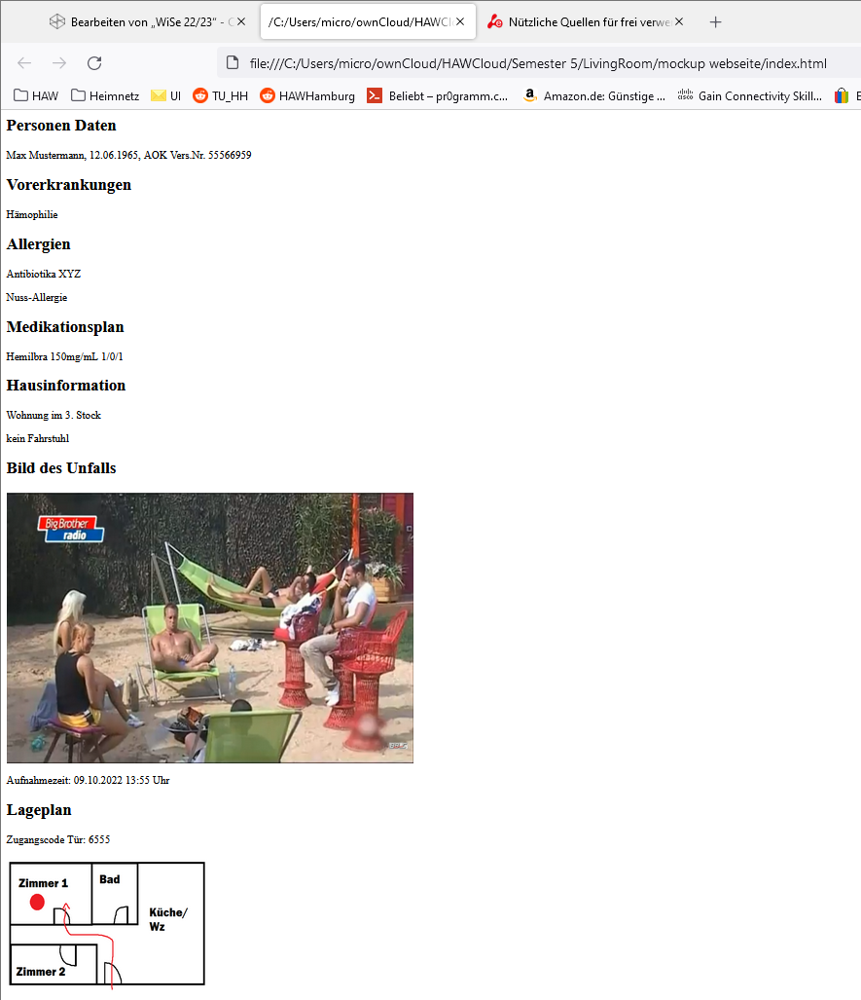

# Modul Dokumentation  - Template

## Modulverantwortliche

- Till Aul till.aul@haw-hamburg.de
- Malte Schick malte-schick@haw-hamburg.de
- Haidar Mortada haidar.mortada@haw-hamburg.de
- Kevin Tobaben kevin.tobaben@haw-hamburg.de
- Stefan Sachmann stefan.sachmann@haw-hamburg.de

## Problemstellung

Eine Person (bewusstlos oder bei Bewusstsein) muss ein Notruf automatisiert absetzen können. Die Herausforderung ist es, die Einsatzkräfte zuverlässig, schnell und umfassend benachrichtigen zu können.  
Darüber hinaus muss für die schnelle medizinische Versorgung der Zugang zur Wohnung gewährleistet werden.

## Modulziel

Ziel ist es die Einsatzkraefte so gut es geht zu unterstützen.  
Konkret bedeutet dies, dass ein Notruf abgesetzt wird und Personendaten inkl. Gesundheitsakte den Rettungskraeften zur Verfuegung gestellt werden. Die sensiblen Personendaten müssen vor fremden Zugriff geschützt werden und dürfen nur von Rettungskräften eingesehen werden.  
Für die Benachrichtung der Einsatzkräfte ist aufgrund der Ausfallsicherheit ein redundanter Benachrichtigungsweg vorgesehen (SMS über das Mobilfunknetz und FAX über das Telefonnetz).  
Zusätzlich zu den Personendaten erhalten die Rettungskräfte Zugangscodes zur Wohnung. Diese dürfen nur zeitlich begrenzt gültig sein.

## Konzept

Das Alarm & Unterstützungsmodul wird mit einer Plug-In Architektur umgesetzt. Die Hauptkomponente "Alarmverwaltung" besitzt einzelne Plugins (SMS-Controller, FAX-Controller, Zugangsauthentifizierer, Website)

### Systemkontext

## Entwicklung

- Host: Die Alarmverwaltung fungiert als Host für das Alarm & Unterstützungsmodul. Dieses nimmt das Notrufsignal entgegen und sorgt für den korrekten Ablauf des Moduls. Benachrichtigt unsere Komponenten, dass der Notruf gestartet werden soll und meldet den Erfolg bzw. Misserfolg an das uebergeordnete System zurueck.  
- Zugangsauthentifizierer: Dieser generiert auf Anfrage einen Zugangscode für die Tür und öffnet die Tür bei erfolgreicher Eingabe über die Klingel. Dazu kommt auch, dass er verwaltet, wie lange ein Code gueltig ist und wie oft der Code eingegeben werden darf, bis der Code ungueltig wird.
- Kommunikation: Hier wird der SMS-Controller implementiert. uebernimmt die Erstellung der SMS-Nachricht und sendet die Nachricht per SMS, anschliessend bestaetigt sie dem Controller den Erfolg. Die SMS wird über eine Android App auf einem Smartphone im Netzwerk gesendet. Zusätzlich ist noch ein  FAX-Controller implementiert. Dieser uebernimmt die Erstellung der Fax-Vorlage und sendet die Nachricht per Fax, anschliessend bestaetigt sie dem Controller den Erfolg.  
- Webseite: Enhaelt das HTML-Template-Engine mit der HTML-Vorlage. Diese erzeugt eine php-Datei. Die Webseite mit den Personendaten kann nur mit einem korrekten Token angezeigt werden. Bei mehrmaligen öffnen der Webseite oder nach einer bestimmten Zeit, wird die php-Datei gelöscht.  
- Klingel: Hierbei handelt es sich um die smarte Klingel, die dazu verwendet wird den Einsatzkraeften Zugang zur Wohnung zu erlauben.
Die Klingel selber besteht aus einem Mikrocontroller, einer RGB LED und einem Knopf. 

### Komponenten

### Extra Komponente (MQTT-HTTP-Converter)
Um die Kommunikation zwischen dem SecondHumanFactor-Modul und den restlichen Modulen in unserem Projekt zu ermöglichen, kommt ein sogenannter Converter ins Spiel.  
Der Converter ist ein MQTT-Client, HTTP-Server, der POST-Requests empfängt und HTTP-Client, der POST-Requests sendet.  
URLs von POST-Requests werden als Topics genommen und direkt gepublished. Umgekehrt funktioniert es genauso.  

**Beispiel**:  
POST /door/code HTTP/1.0 -> publish("door/code")   

*Responses des HTTP-Servers*:
- 400 Bad Request: wenn die POST-Request keinen Inhalt hat (Payload)
- 406 Not Acceptable: wenn die URL nur aus "/" besteht (ohne genannten Pfad) 
- 404 Not Found: wenn die URL kein MQTT-Topic ist
- 200 OK: wenn die POST-Requst als MQTT-Nachricht gepublished werden konnte

### Klassen
- Klingel

### Schnittstellen

- Die Komponenten kommunizieren ueber MQTT miteinander. 
    + Siehe Liste in Teams: Allgemein/Dateien/Schnittstellendefinition/MQTT_COM_Overview.xlsx
- Die Kommunikation mit der Second Human Factor Authentifizierungs Komponente erfolgt ueber MQTT (ggf. ueber den MQTT<->HTTP Konvertierer). 
    + Input: 
        - Anforderung eines Zugangscodes
    + Output: 
        - Zugangscode fuer die Klingel nach Anforderung in dieser Form: -..-.|-.---..-.-
        - Rueckmeldung dieser Komponente ob Notrufabsetzung erfolgreich war
- Die Kommunikation mit der TurTech Komponente erfolgt ueber Shared Memory.
    + Input:
        - Bilderverzeichnisse: /home/projectuser/projectlp/photos & /home/projectuser/projectlp/location
         
- Zur Darstellung der relevanten Informationen fuer die Einsatzkraefte wird eine Webseite zur Verfuegung gestellt.
    + Output: 
        - 

- Die Klingel kommuniziert ueber die RGB LED mit dem Nutzer.
    + Output:
        - LED leuchtet 3s Gruen, sobald der Code richtig eingegeben wurde und die Tuer sich oeffnet
        - LED leuchtet 3s Rot, sobald der Nutzer einen Reset durchfuehrt

- Die Alarmverwaltung kommuniziert über MQTT mit dem Architektur-Modul
    + Input
        - JSON-Datei nach diesem Schema: [JSON Schema](./JSON_Schema_architektur.json)
    + Output
        - JSON-Datei nach diesem Schema: [JSON Schema](./JSON_Schema_notruferfolgt.json)
### Verwendete Technologien

- JINJA2 wird zur Erstellung der Webseite verwendet.  
- APACHE wird als Webserver verwendet.  
- JSON Libary für das Parsen der JSON Objekte.  
- FPDF für den FAX-Controller um PDF-Dateien zu erstellen.  
- SOCKET für die UDP/TCP Kommunikation.  
- Android Framework für die Smartphone App zum SMS verwendet.  

Je Nach Plattform werden verschiedene MQTT-Client Implementationen verwendet. Dies sind unter anderem pahoMQTT und AsyncMQTT.

### Präsention

## Klingel

## Individuelle Präsentation
Für die Individuelle Präsentationen der Klingel, benötigen wir eine eigene Anfrage an die Klingel damit ein Code erstellt werden kann. Dafür haben wir bereits eine "Test-Datei" erstellt. Diese erstellt einen Client und verbindet sich mit dem MQTT Broker. Damit haben wir nun einen Code, welcher bei der Klingel eingegeben werden kann zum Tür öffnen und unser Modul kann unabhängig von den anderen Vorgestellt werden.

## Gruppenpräsentation
Bei der Gruppenpräsentation, bekommen wir im gegensatz zur Individuellen Präsentation von anderen Teams die Anfrage zum erstellen eines Codes. Der Rest des Ablaufs ist der gleiche wie in der Beschreibung zur Individuellen Präsentation.

## Alarmverwaltung

Im normalen Verlauf der Vorstellung mit allen Komponenten wird auf das Startsignal gewartet. Dann wird zuerst der Türcode angefragt. Sobald der Code eingetroffen ist, wird die Website mit den ersten Personendaten und dem Türcode erstellt. Diese ersten Schritte werden nicht dargestellt. Danach wird der Sendevorgang der SMS gestartet. Dass die SMS versendet wurde, kann auf dem Handy, das für das Senden zuständig ist, eingesehen werden. Danach soll auf einem weiteren Handy, welches die Schnittstelle der Notrufzentrale darstellt, die angekommene SMS angezeigt werden. Die Website soll auf einem Bildschirm oder wenn möglich auf einem Tablet während der Präsentation nach dem Eintreffen der SMS geöffnet werden, um zeigen zu können, wie der Türcode eingegeben werden muss (Tablet als Ersatz für das NIDApad). Außerdem sollen die Updates für Bilder oder den Heartbeat dort erkennbar sein. Um zu zeigen, wie ein Fax aussehen würde, falls das SMS-Versenden nicht funktioniert, wird außerdem ein Bildschirm benötigt, um die dazu erstellte PDF anzuzeigen. (Dies kann auf dem gleichen Gerät wie auch der Website gezeigt werden)
Wenn die Komponente einzeln laufen soll, kann dies mit Hilfe der erstellten Testmockups durchgeführt werden(Startsignal, Heartbeat und bilder update, Türcode)

## Benötigte Geräte: 
- 2 Handys
- 1 Bildschirm/Tablet

## Referenzen

\<Welche aehnlichen Projekte habt ihr als Inspiration genutzt? Welche Quellen habt ihr in der vorab Recherche gefunden?\>
- SMS Notruf Hörgeschädigte  
https://www.hamburg.de/feuerwehr/service/15338834/sms-nothilfeersuchen-fuer-hoergeschaedigte/

- Telematik Infrastruktur  
https://www.kbv.de/media/sp/Infografik_TI-neue-Anwendungen_2021.pdf

- Smart-Home-Technologie für Telemedizin und Notfallmanagement  
https://link.springer.com/article/10.1007/s12652-012-0129-8#Sec11  

- Schnittstelle Frauenhofer  
https://www.skverlag.de/rettungsdienst/meldung/newsartikel/zink-die-schnittstelle-die-leben-rettet.html

- SSL Zertifikate  
https://forums.docker.com/t/setup-local-domain-and-ssl-for-php-apache-container/116015/2

- Python PDF  
https://docs.automationanywhere.com/de-DE/bundle/enterprise-v2019/page/enterprise-cloud/topics/aae-client/bot-creator/using-the-workbench/cloud-create-a-pdf-using-python-script.html

- One-Time URLs  
https://www.sitepoint.com/generating-one-time-use-urls/

- NIDA Tablet  
https://www.meddv.de/produkte/nidapad

- DIVERA 24/7  
https://www.divera247.com/

